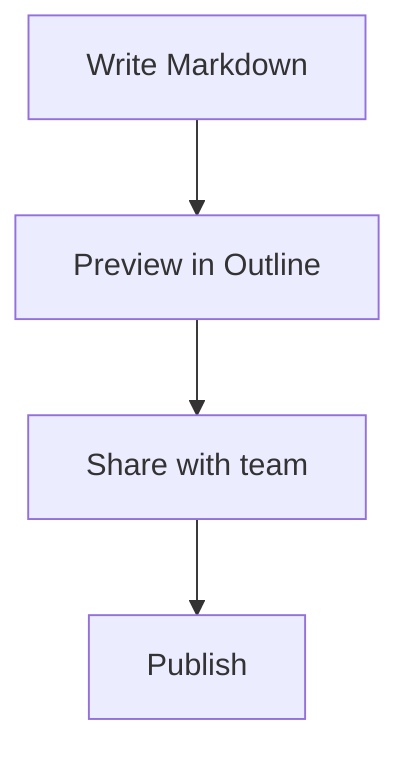
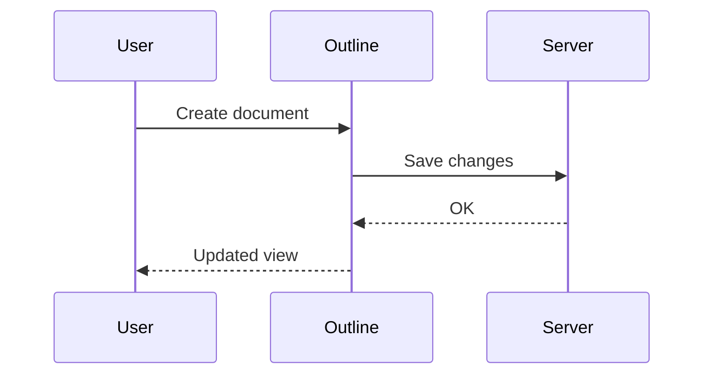

# test

## "Markdown Feature Showcase" author: "Sarin" date: "2026-01-28" tags: \[markdown, outline, docs, demo\]

# Markdown Feature Showcase

> A single document that demonstrates common Markdown features: formatting, lists, links, images, tables, code, quotes, math, diagrams, footnotes, and more.


---


:::tip
u can embed too

:::

[nesting test](./test/nesting%20test.md) 

## Table of Contents

* [Markdown Feature Showcase](#markdown-feature-showcase)
  * [Table of Contents](#table-of-contents)
  * [1) Text Formatting](#1-text-formatting)
  * [2) Headings](#2-headings)
  * [3) Paragraphs & Line Breaks](#3-paragraphs--line-breaks)
  * [4) Blockquotes](#4-blockquotes)
  * [5) Lists](#5-lists)
  * [6) Links](#6-links)
  * [7) Images](#h-7-images)
  * [8) Tables](#8-tables)
  * [9) Code](#9-code)
  * [10) Task Lists](#10-task-lists)
  * [11) Horizontal Rule](#11-horizontal-rule)
  * [12) Inline HTML (Optional)](#12-inline-html-optional)
  * [13) Footnotes](#13-footnotes)
  * [14) Math (LaTeX)](#14-math-latex)
  * [15) Mermaid Diagrams](#15-mermaid-diagrams)
  * [16) Collapsible Sections (HTML)](#16-collapsible-sections-html)
  * [17) Emoji (Optional)](#17-emoji-optional)
  * [18) Callouts / Admonitions (App-dependent)](#18-callouts--admonitions-app-dependent)
  * [19) Keyboard Keys](#19-keyboard-keys)
  * [20) Escaping Characters](#20-escaping-characters)
  * [21) Reference Links](#21-reference-links)
  * [22) Final Mini Demo](#22-final-mini-demo)


---

## 1) Text Formatting

Normal text.

**Bold text**

*Italic text*

***Bold + Italic***

~~Strikethrough~~

`Inline code`

Highlight (app-dependent): ==highlighted text==

Subscript (HTML): H<sub>2</sub>O\nSuperscript (HTML): x<sup>2</sup>


---

## 2) Headings

# H1

## H2

### H3

#### H4

##### H5

###### H6


---

## 3) Paragraphs & Line Breaks

This is a paragraph.

This is another paragraph (separated by a blank line).

Line break using two spaces at the end of a line.\nLike this.


---

## 4) Blockquotes

> This is a blockquote.
>
> It can span multiple lines.

Nested:

> Level 1
>
> > Level 2
> >
> > > Level 3


---

## 5) Lists

### Unordered List

* Item A
* Item B
  * Sub item B1
  * Sub item B2
    * Sub-sub item

### Ordered List


1. Step one
2. Step two
3. Step three

### Mixed


1. Install tools
   * uv
   * python
2. Run project
   * `uv run main.py`


---

## 6) Links

Inline link: [Outline Website](https://www.getoutline.com/)

Autolink: <https://example.com>

Email link: [sarin@example.com](mailto:sarin@example.com)


---

## 7) Images

### Image (External)

 

### Image with title text

 

### Image as a link

 


---

## 8) Tables

| Feature | Supported? | Notes |
|--------:|:----------:|-------|
| Bold    | ✅          | `**bold**` |
| Italic  | ✅          | `*italic*` |
| Code    | ✅          | Inline + blocks |
| Tables  | ✅          | GitHub style |

Alignment demo:

| Left | Center | Right |
|:-----|:------:|------:|
| a    | b      | c     |
| 10   | 20     | 30    |


---

## 9) Code

### Inline code

Use `python` to run scripts.

### Code block (no language)

This is a plain code block. No syntax highlighting.

```

### Code block (Python)
```python
from dataclasses import dataclass

@dataclass
class User:
    name: str
    role: str = "admin"

u = User("Sarin")
print(u)
```

### Code block (JSON)

```json
{
  "app": "Jell0 Docs",
  "version": "1.0.0",
  "features": ["markdown", "search", "collaboration"]
}
```

### Code block (Bash)

```bash
uv venv
uv pip install -r requirements.txt
uv run python main.py
```


---

## 10) Task Lists

- [x] Create markdown doc
- [x] Add images
- [x] Add tables
- [ ] Add custom theme
- [ ] Export as PDF


---

## 11) Horizontal Rule


---

## 12) Inline HTML (Optional)

> Some Markdown apps allow HTML, some sanitize it.

<div style="padding:12px;border:1px solid #ddd;border-radius:10px;"> <b>HTML Box:</b> This is an inline HTML block. </div>


---

## 13) Footnotes

Here is a statement with a footnote.\[^1\]

\[^1\]: This is the footnote text.


---

## 14) Math (LaTeX)

Inline math: $E = mc^2$

Block math:

$$
\int_{0}^{\infty} e^{-x^2} dx = \frac{\sqrt{\pi}}{2}
$$


---

## 15) Mermaid Diagrams

> Mermaid support depends on the app configuration.

### Flowchart



### Sequence Diagram




---

## 16) Collapsible Sections (HTML)

<details> <summary><b>Click to expand</b></summary>

This section is collapsible (if your renderer supports it).

* Hidden item 1
* Hidden item 2

</details>


---

## 17) Emoji (Optional)

Works if emoji rendering is enabled:

✅ 🚀 🐐 📌 🔥


---

## 18) Callouts / Admonitions (App-dependent)

Some apps support this style:

> \[!NOTE\] This is a NOTE callout.

> \[!TIP\] This is a TIP callout.

> \[!WARNING\] This is a WARNING callout.

actually callous are used like the following


:::info
HEy

:::


---

## 19) Keyboard Keys

Use `<kbd>` tag:

Press <kbd>Ctrl</kbd> + <kbd>S</kbd> to save.


---

## 20) Escaping Characters

To show literal Markdown symbols:

*not italic* **not bold**

# not a heading


---

## 21) Reference Links

This is a reference link to [Outline](https://www.getoutline.com/).


---

## 22) Final Mini Demo

### Quick Summary Table

| Section | Purpose |
|---------|---------|
| Text Formatting | Basic styling |
| Images  | Visual content |
| Code    | Dev docs |
| Mermaid | Diagrams |
| Math    | Scientific writing |


[https://www.tldraw.com/f/W9FPB--aTaVp%5Fhs3d1pa1?d=v374.110.1656.1076.page](https://www.tldraw.com/f/W9FPB--aTaVp%5Fhs3d1pa1?d=v374.110.1656.1076.page)

[https://www.tldraw.com/f/Auf6ZAw0R2iza8aYxAZh%5F?d=v0.0.1656.1076.page](https://www.tldraw.com/f/Auf6ZAw0R2iza8aYxAZh%5F?d=v0.0.1656.1076.page)

 

[https://excalidraw.com/#json=HkjFrgoMhhH1R6x39cYz1,buVCrfhocmDEKnvQj8dTZQ](https://excalidraw.com/#json=HkjFrgoMhhH1R6x39cYz1,buVCrfhocmDEKnvQj8dTZQ)

[simplere](./simplere.md)